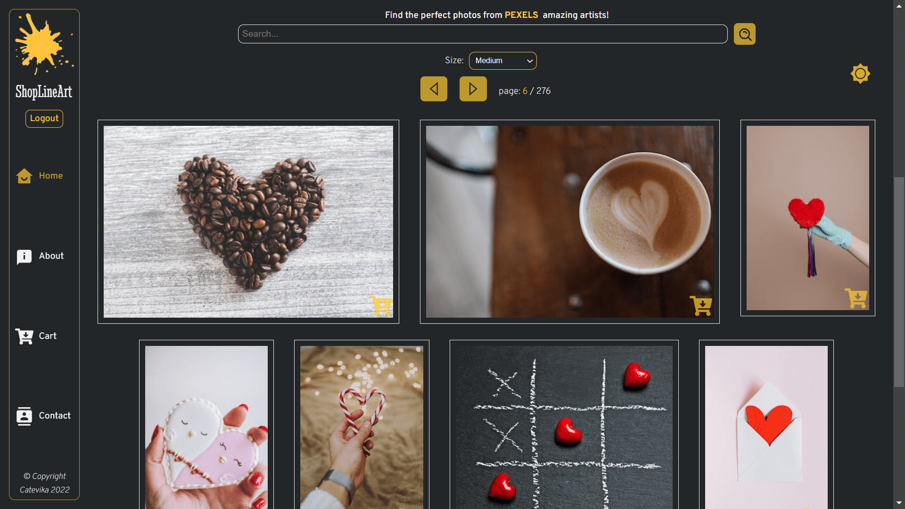

# ShopLineArt CLIENT



Photo Gallery App with 3 main features:

- photo search by term
- display of the photos in different sizes
- protected multiple photos download, zip folder format with credits availability

## Table of Content <!-- omit in toc -->

- [ShopLineArt CLIENT](#shoplineart-client)
  - [General Information](#general-information)
  - [NPM packages](#npm-packages)
  - [ShopLineArt SERVER](#shoplineart-server)
  - [To clone the ShopLineArt app SERVER and CLIENT repositories](#to-clone-the-shoplineart-app-server-and-client-repositories)
  - [Deploy the client to Render](#deploy-the-client-to-render)

## General Information

- App: **Vite + React plugin**
- Router: **React-router-dom**
- API: **Pexels**

## NPM packages

- Promise based HTTP client: **axios**
- Icons: **react-icons** & **mui**
- Notifications: **react-toastify**
- File saver: **file-saver**
- ZIP file: **jszip**
- Email contact: **emailjs**

## ShopLineArt SERVER

See [https://github.com/Catevika/catevika_shoplineart-server](https://github.com/Catevika/catevika_shoplineart-server)

---

## To clone the ShopLineArt app SERVER and CLIENT repositories

```bash
mkdir shoplineart-clone
cd shoplineart-clone
```

then

```bash
mkdir server
cd server
git clone https://github.com/Catevika/catevika_shoplineart-server.git
npm install
touch .env
```

---

Create a project in MongoDB and set MONGO_URI

Set an EXPRESS_PORT, mine is at '8800'

Set JWT_KEY with your random secret phrase used during the token generation

then

```bash
cd ..
mkdir client
cd client
git clone https://github.com/Catevika/catevika_shoplineart-client.git
npm install

touch .env
```

---

Create a **PEXELS** developer account to set the **VITE_PEXELS_API_KEY**

Set these variables in the client environment. Copy `.env.example` to `.env` for local development.

Set **VITE_BASE_URL** to the URL of the deployed API service, without a trailing slash:

- development: your local API URL, for example `http://localhost:8800`
- production: your API Render service URL, for example `https://shoplineart-api.onrender.com`

---

Create an **EMAILJS** developer account

Create your **template** with: fullname, email, subject, message

Set:

- **VITE_EMAILJS_PUBLIC_KEY**
- **VITE_EMAILJS_SERVICE_ID**
- **VITE_EMAILJS_TEMPLATE_ID**

then

```bash
cd ../server
npm run dev
```

See the respective **package.json** files to launch the client and the server separately

## Deploy the client to Render

This repository includes `render.yaml` for a Render Static Site. Create a Render Blueprint from the repository, then set the `VITE_*` environment variables when prompted. Render runs `npm ci && npm run build`, publishes `dist`, and rewrites client-side routes to `index.html` so direct links such as `/home` work after deployment.
